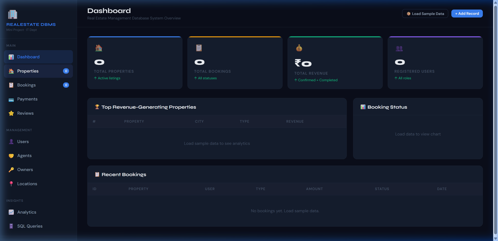
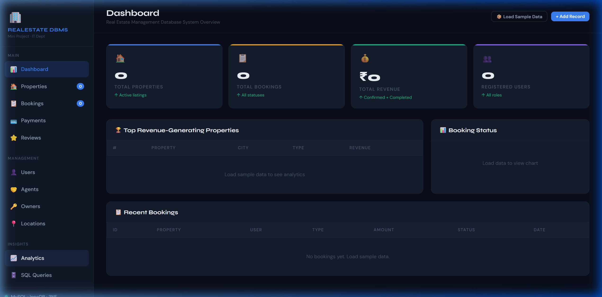

# Real Estate Management Database System

A comprehensive web-based Real Estate Management Database System. It demonstrates the use of a relational database schema designed in 3NF and provides an interactive UI to manage and track properties, bookings, payments, and users.

## Features

- **Dashboard**: High-level overview of real estate operations, top-performing properties, and recent bookings.
- **Properties Catalog**: View, filter, and add residential and commercial properties.
- **Booking Management**: Full lifecycle tracking of property bookings (Purchase, Rent, Site Visit).
- **Payment Processing**: Record payment installments linked to specific bookings.
- **User & Role Management**: RBAC with 'buyer', 'tenant', 'agent', and 'admin' roles.
- **Analytics**: Visualizations for revenue distributions and location performance.
- **SQL Reference**: Interactive code viewer containing schema setup, and pre-written analytic SQL queries.

## Technologies Used

- **Frontend**: HTML5, CSS3 (Custom Properties, Flexbox, CSS Grid), Vanilla JavaScript.
- **Charts**: Chart.js for data visualization.
- **Database (Simulated & Schema)**: In-memory JavaScript database for UI simulation, along with fully normalized MySQL schemas for production implementation.

## Project Structure

```
.
├── css/
│   └── styles.css
├── js/
│   └── app.js
├── sql/
│   ├── 01_schema.sql
│   ├── 02_seed_data.sql
│   ├── 03_query_full_listing.sql
│   ├── 04_query_revenue_by_type.sql
│   ├── 05_query_top_agents_and_ratings.sql
│   └── 06_transaction_acid_booking.sql
├── preview_images/
│   ├── dashboard.png
│   └── analytics.png
└── index.html
```

## Preview Images

### Dashboard


### Analytics


## Getting Started

To run the frontend simulation locally:
1. Clone the repository.
2. Open `index.html` in any modern web browser.
3. Click on the **"Load Sample Data"** button to populate the UI with demonstration records.

To setup the actual database:
1. Install MySQL (version 8+ recommended).
2. Execute the scripts in the `sql/` directory sequentially, starting from `01_schema.sql`.

## Database Design

The system implements a normalized 3NF relational structure containing 9 main tables:
- `USERS`, `LOCATIONS`, `PROPERTY_TYPES`, `OWNERS`, `AGENTS`
- `PROPERTIES` (Central hub with multiple FKs)
- `BOOKINGS`, `PAYMENTS`, `REVIEWS`

Includes appropriate constraints (UNIQUE, CHECK), ON DELETE cascades, and optimized indexes.
